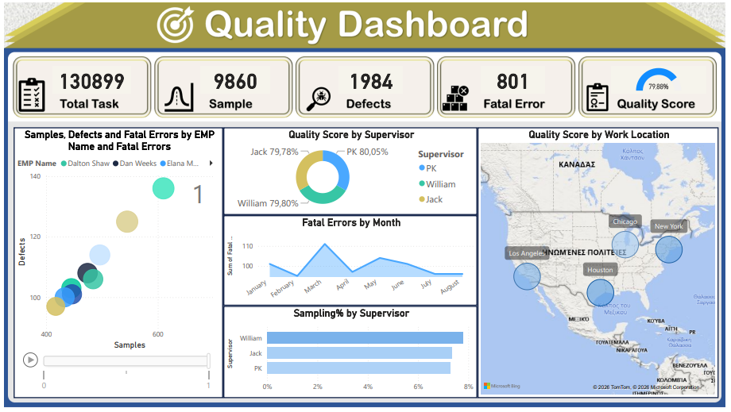

# Quality Performance Dashboard (Power BI)

## Overview
This project presents an interactive Power BI dashboard designed to analyze employee performance, quality metrics, and operational risk indicators.

The dashboard transforms raw operational data into actionable business insights through KPI tracking, performance comparisons, and geographic visualization.

---

## Objectives
The project aims to:

- Monitor overall operational quality using KPI indicators
- Evaluate employee performance and defect rates
- Identify fatal error patterns over time
- Compare supervisor performance
- Visualize quality metrics geographically

---

## Dashboard Features

### KPI Summary Panel
- Total tasks processed
- Sample size analyzed
- Total defects detected
- Fatal error count
- Overall quality score

### Employee Performance Analysis
- Scatter plot of samples vs defects
- Performance comparison between employees
- Supervisor-level quality breakdown

### Risk & Trend Monitoring
- Fatal errors trend by month
- Sampling rate comparison by supervisor
- Quality score distribution analysis

### Geographic Analysis
- Quality score visualization by work location
- Identification of regional performance differences

---

## Tools Used
- Power BI Desktop
- Data modeling
- DAX measures
- Interactive filtering
- Dashboard storytelling

---

## Skills Demonstrated
- Business KPI interpretation
- Data modeling in Power BI
- Interactive dashboard design
- Performance analytics
- Visual storytelling for decision making

---

## Dashboards

### Quality Dashboard

### Employee Performance

---

## How to Use
1. Open the `.pbix` file in Power BI Desktop
2. Navigate between report pages
3. Use filters to explore employee and supervisor performance
4. Interact with visuals for deeper insights

---

## Author
Zacharias Pasparakis
